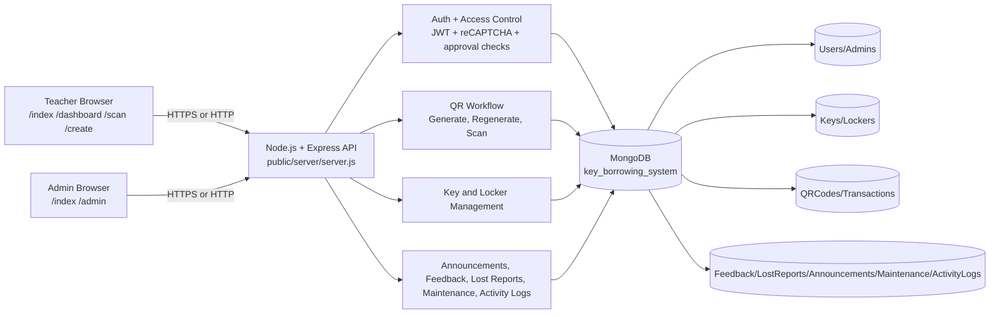
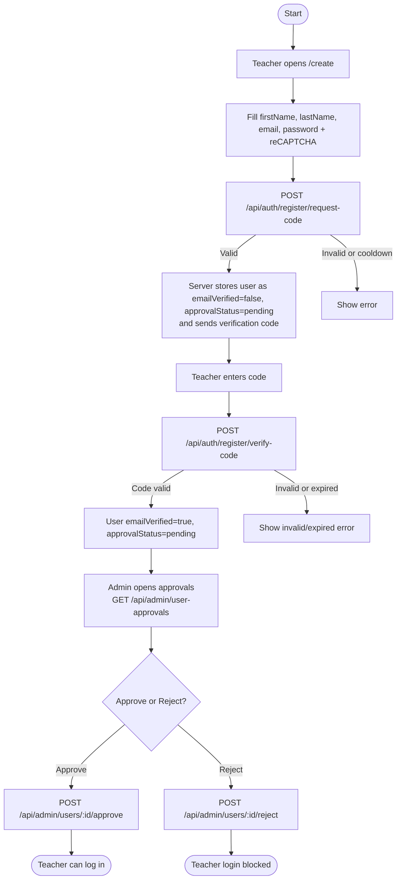
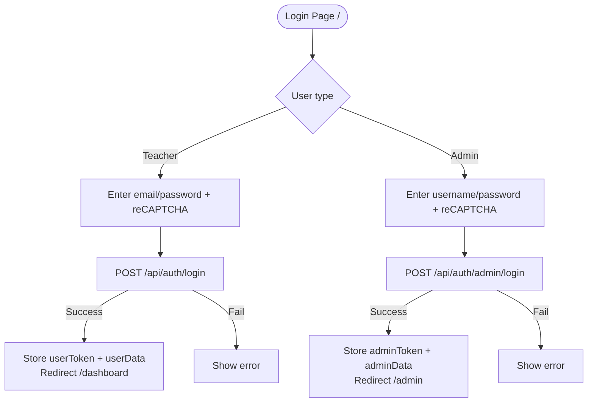
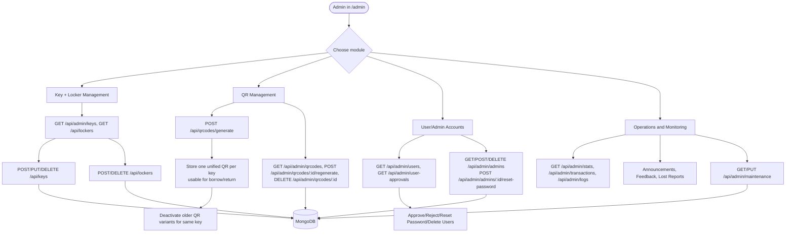
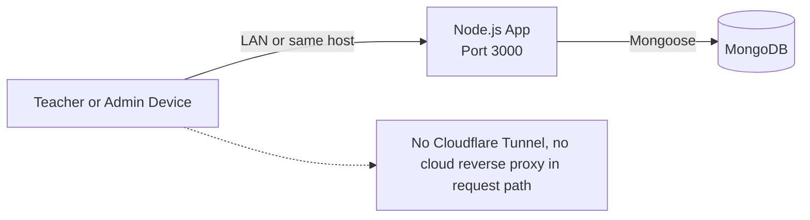

# Key Borrowing System Flowchart (No Cloudflare)

This flow is based on the current implementation in `public/server/server.js` and frontend scripts.
All traffic is direct Browser -> Node/Express API -> MongoDB (no Cloudflare tunnel in path).

## 1. System Architecture (Direct Access)



## 2. Teacher Registration and Approval Flow



## 3. Login Flow (Teacher/Admin)



## 4. Borrow/Return Flow via QR Scan

```mermaid
flowchart TD
    B0([Teacher in /dashboard]) --> B1{Action}

    B1 -->|Borrow| B2[Click Borrow Key]
    B1 -->|Return| B3[Click Return Key]

    B2 --> B4[Redirect /scan]
    B3 --> B5[Redirect /scan]

    B4 --> B6[Scan QR]
    B5 --> B6

    B6 --> B7[Client checks QR JSON format]
    B7 -->|Invalid| BE1[Show error and resume scanning]
    B7 -->|Valid| B8[POST /api/qrcodes/scan\n{ qrData }]

    B8 --> B9{Server validation}
    B9 -->|Fail: auth, approval, maintenance, QR invalid, inactive, key state mismatch| BE2[Return error]
    B9 -->|Pass| B10{Auto-resolve action}

    B10 -->|Borrow| B11[Require key.status=available]
    B11 --> B12[Set key.status=borrowed\nset borrowedBy + borrowedAt]
    B12 --> B13[Create Transaction action=borrow]
    B13 --> B14[Mark QR used=true\nusedAt + usedBy]
    B14 --> B15[ActivityLog key.borrow]

    B10 -->|Return| B16[Require key.status=borrowed\nand borrowedBy=current user]
    B16 --> B17[Set key.status=available\nclear borrowedBy + borrowedAt]
    B17 --> B18[Create Transaction action=return]
    B18 --> B19[Mark QR used=true\nusedAt + usedBy]
    B19 --> B20[ActivityLog key.return]

    B15 --> B21[Success response]
    B20 --> B21
    B21 --> B22[Client shows success and redirects /dashboard]

    BE2 --> B23[Client shows error and resumes scanning]
```

## 5. Admin Operational Flow



## 6. No-Cloudflare Deployment Path


