# Key Borrowing System Flowchart

This document presents a clean thesis-style flowchart set for the current implementation of the Key Borrowing System.
It reflects the current setup:

- direct local access in `Pure Fast Mode`
- live camera QR scanning
- email verification for teacher registration
- Node.js/Express backend with MongoDB
- ESP32 locker controller for physical unlock operations
- no reCAPTCHA in the active login and registration flow

Coverage note:

- Figures 1 to 8 describe the main operational flow of the system.
- Figures 9 to 11 describe supporting flows that are also part of the full implementation, including startup/configuration, password reset, and maintenance control.

## Figure 0. System Startup and Runtime Configuration

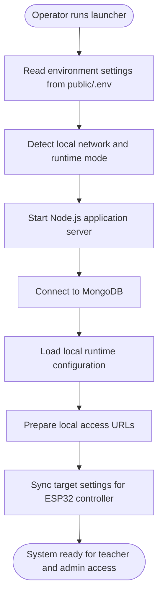

## Figure 1. Overall System Architecture

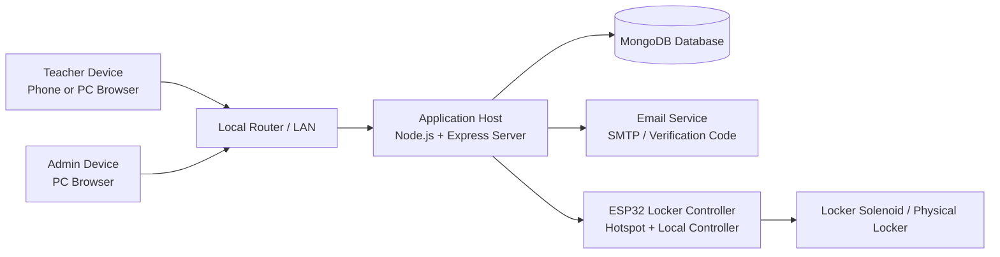

## Figure 2. Deployment and Network Setup

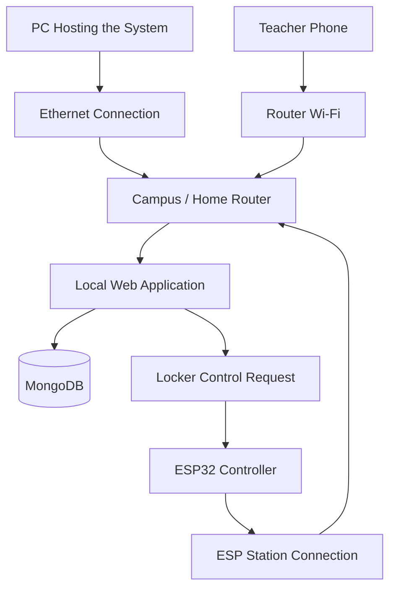

## Figure 3. Teacher Account Registration and Approval Flow

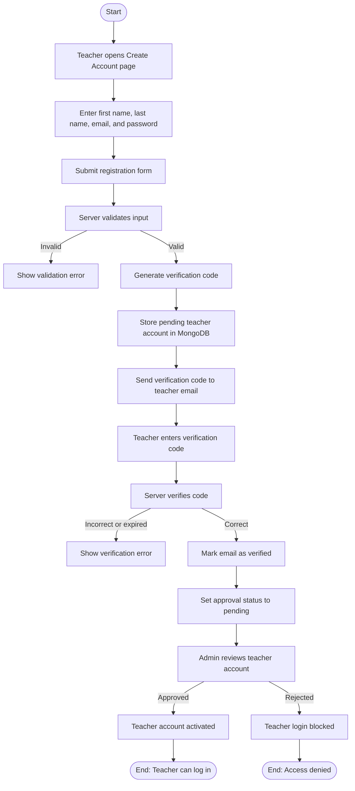

## Figure 4. Login Flow for Teacher and Admin

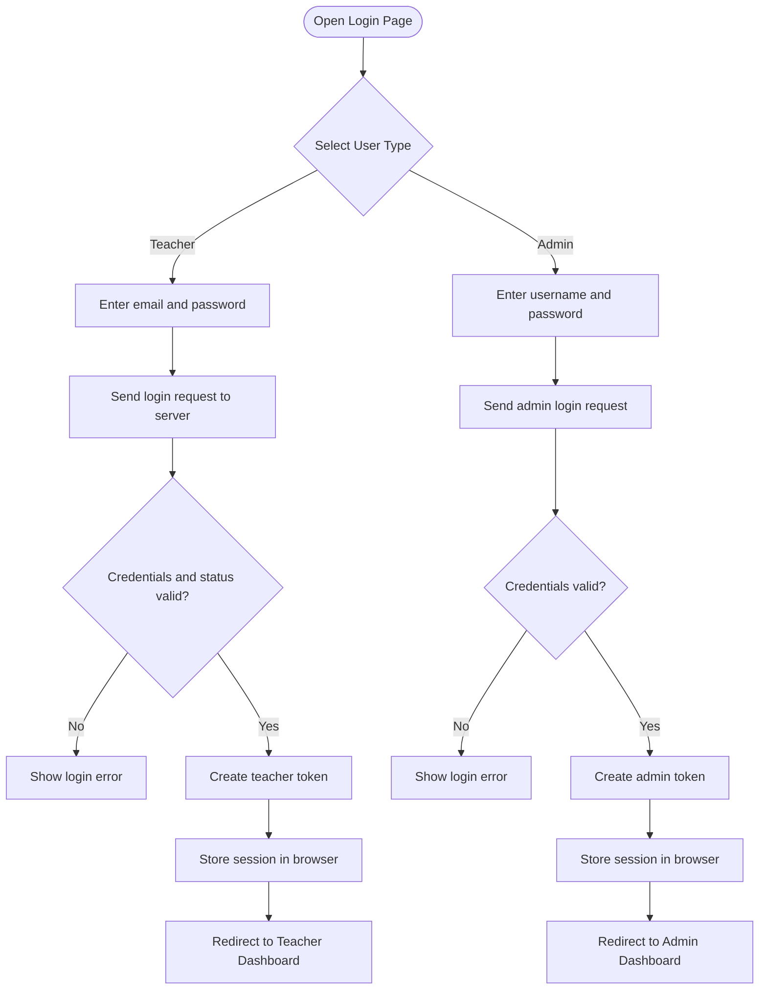

## Figure 5. Borrow and Return Flow Through QR Scanning

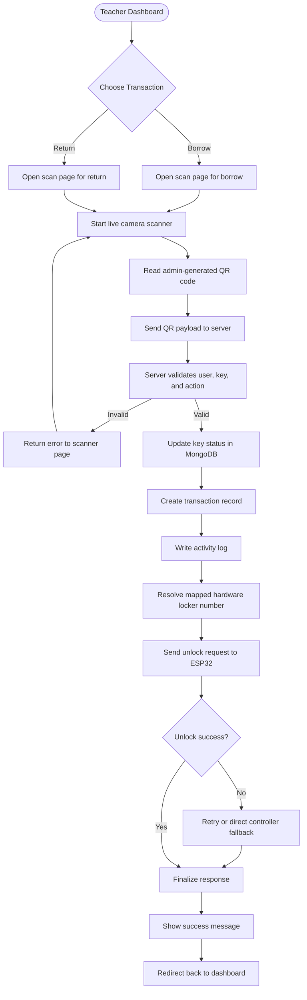

## Figure 6. ESP32 Locker Unlock Flow

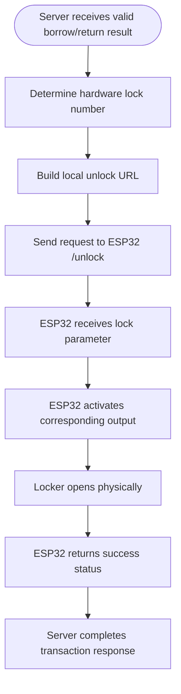

## Figure 7. Admin Operational Flow

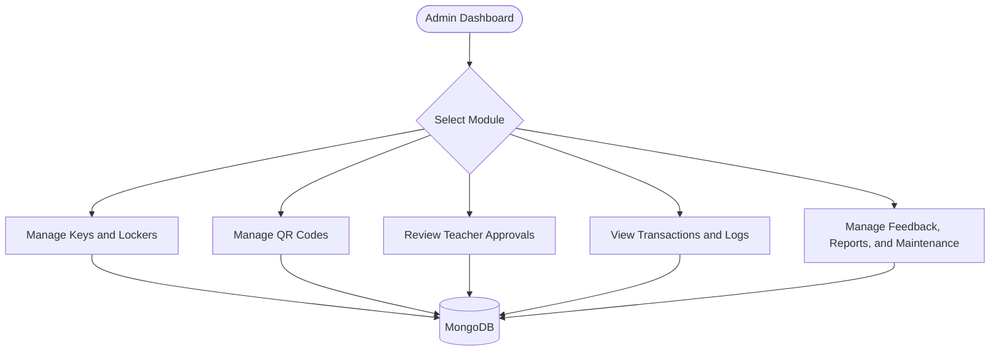

## Figure 8. End-to-End Operational Summary

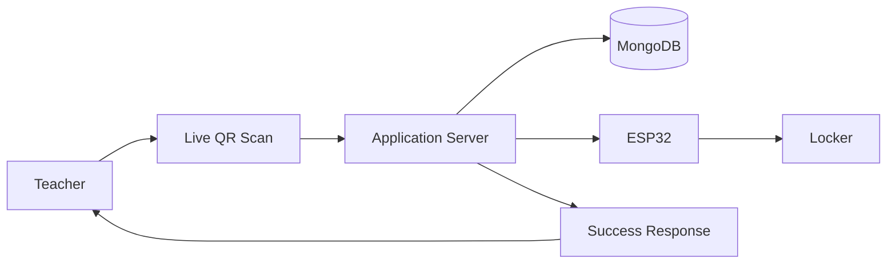

## Figure 9. Password Reset Flow

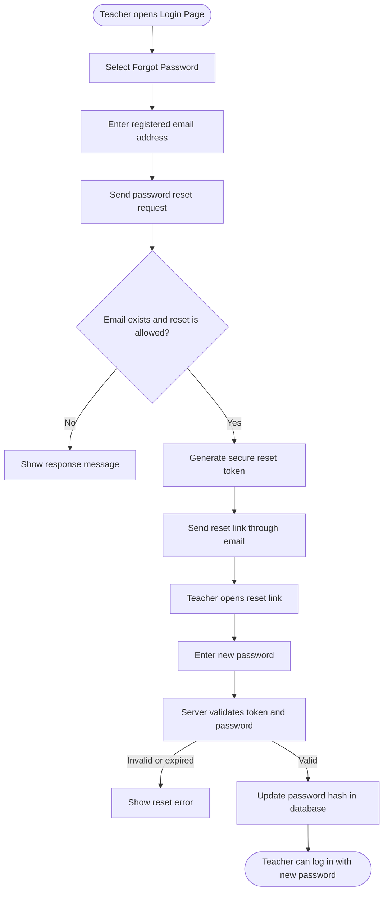

## Figure 10. Maintenance Control Flow

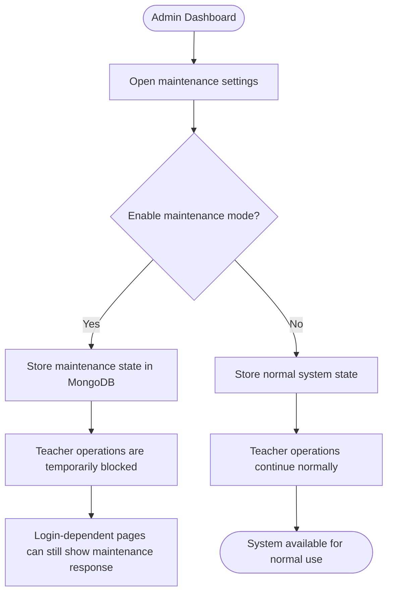

## Figure 11. Supporting Teacher and Admin Service Modules

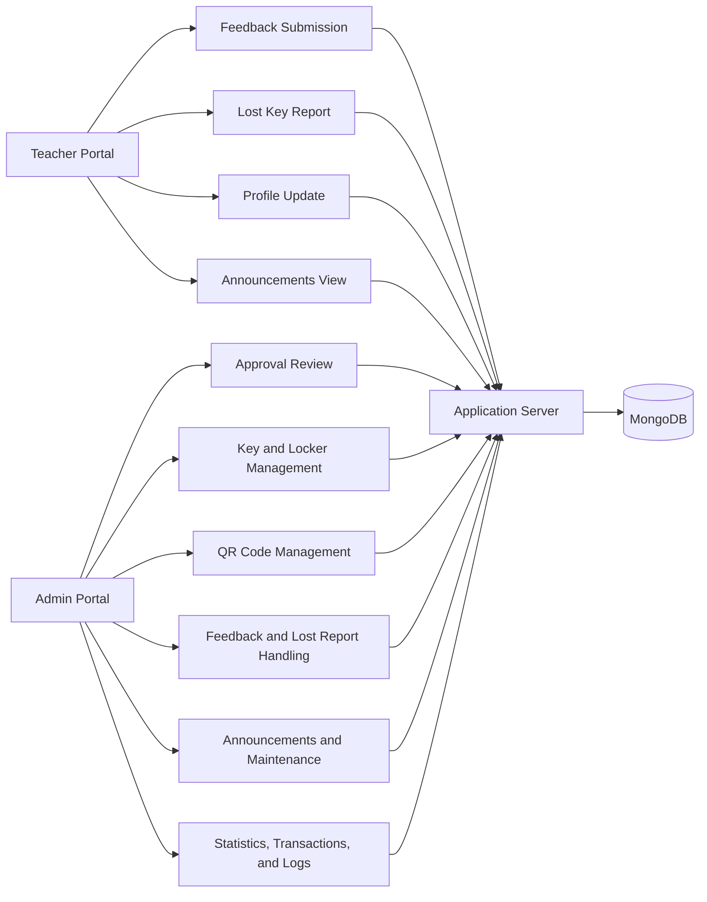

## Recommended Use in Thesis

For a thesis document, it is usually better not to force the entire system into one oversized diagram.
The cleaner and more academically acceptable approach is:

1. Use Figure 1 as the architectural overview.
2. Use Figures 3 to 8 as the main transaction and control flows.
3. Use Figures 9 to 11 as supporting operational flows.

This means the file now covers both:

- the core system flow
- the important supporting flows that exist in the actual implementation

## Suggested Thesis Caption Text

You may use the following short caption under the diagram set:

> The Key Borrowing System uses a local web-based client-server architecture where teachers and administrators access the application through a browser, transactions are processed by a Node.js and Express backend, records are stored in MongoDB, and validated QR transactions trigger an ESP32-based locker controller for physical key access.
