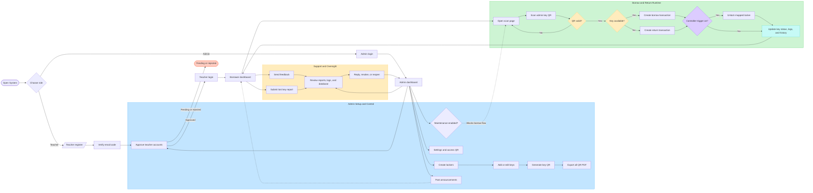

# Key Borrowing System Flowchart

```mermaid
flowchart LR
    start([Open System])
    chooseRole{Choose role}
    teacherRegister[/Teacher register/]
    emailVerify[Verify email code]
    teacherBlocked([Pending or rejected])
    teacherLogin[Teacher login]
    adminLogin[Admin login]
    teacherDashboard[Borrower dashboard]
    adminDashboard[Admin dashboard]

    subgraph adminOps ["Admin Setup and Control"]
        approveUsers[Approve teacher accounts]
        manageLockers[Create lockers]
        manageKeys[Add or edit keys]
        generateQr[Generate key QR]
        exportQr[Export all QR PDF]
        systemSettings[Settings and access QR]
        maintenanceMode{Maintenance enabled?}
        announce[Post announcements]
    end

    subgraph runtimeFlow ["Borrow and Return Runtime"]
        openScanner[Open scan page]
        scanQr[Scan admin key QR]
        qrValid{QR valid?}
        keyAvailable{Key available?}
        borrowTx[Create borrow transaction]
        returnTx[Create return transaction]
        controllerOn{Controller trigger on?}
        unlockLocker[Unlock mapped locker]
        updateRecords[Update key status, logs, and history]
    end

    subgraph supportFlow ["Support and Oversight"]
        feedback[Send feedback]
        lostReport[Submit lost key report]
        reviewRecords[Review reports, logs, and database]
        resolveCase[Reply, resolve, or reopen]
    end

    start --> chooseRole
    chooseRole -->|Teacher| teacherRegister
    chooseRole -->|Admin| adminLogin

    teacherRegister --> emailVerify --> approveUsers
    approveUsers -->|Approved| teacherLogin
    approveUsers -->|Pending or rejected| teacherBlocked

    teacherLogin --> teacherDashboard
    adminLogin --> adminDashboard

    adminDashboard --> approveUsers
    adminDashboard --> manageLockers --> manageKeys --> generateQr --> exportQr
    adminDashboard --> systemSettings
    adminDashboard --> announce
    adminDashboard --> reviewRecords
    adminDashboard --> maintenanceMode

    announce -.-> teacherDashboard
    maintenanceMode -.->|Blocks borrow flow| openScanner

    teacherDashboard --> openScanner --> scanQr --> qrValid
    qrValid -->|No| openScanner
    qrValid -->|Yes| keyAvailable

    keyAvailable -->|Yes| borrowTx
    keyAvailable -->|No| returnTx

    borrowTx --> controllerOn
    returnTx --> controllerOn
    controllerOn -->|Yes| unlockLocker --> updateRecords
    controllerOn -->|No| updateRecords
    updateRecords --> teacherDashboard

    teacherDashboard --> feedback --> reviewRecords
    teacherDashboard --> lostReport --> reviewRecords
    reviewRecords --> resolveCase --> adminDashboard

    style adminOps fill:#C2E5FF,stroke:#3DADFF
    style runtimeFlow fill:#CDF4D3,stroke:#66D575
    style supportFlow fill:#FFECBD,stroke:#FFC943
    style teacherBlocked fill:#FFCDC2,stroke:#FF7556
    style qrValid fill:#FFECBD,stroke:#FFC943
    style keyAvailable fill:#FFECBD,stroke:#FFC943
    style controllerOn fill:#DCCCFF,stroke:#874FFF
    style updateRecords fill:#C6FAF6,stroke:#5AD8CC
```
